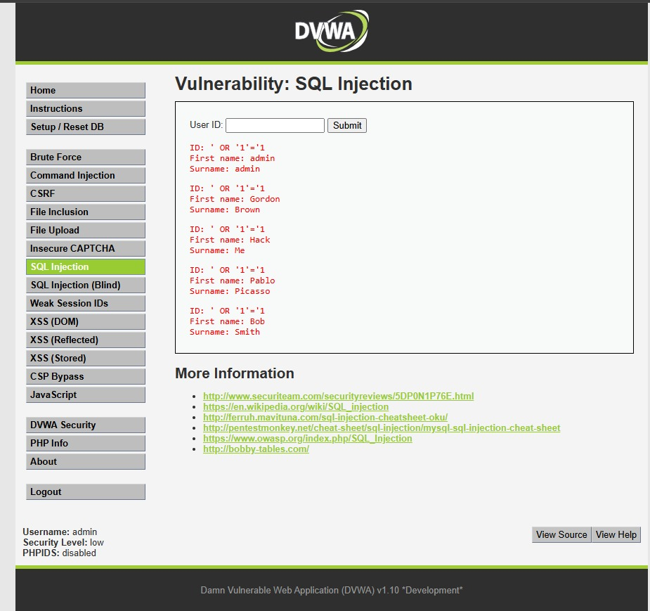

## 1. Evidencia del Ataque
*   **Módulo:** SQL Injection  
*   **Payload (Texto introducido en el campo User ID):** `' OR '1'='1`  
*   **Evidencia Visual:**  

*(Esta captura de pantalla demuestra cómo la aplicación devolvió el listado completo de todos los usuarios registrados en el sistema en lugar de mostrar solo uno).*

---

## 2. Explicación Técnica 
Imagine que el formulario del portal web es un archivador donde usted le pide al guardia (el servidor) que le traiga una ficha escribiendo el nombre en un papel. Una **Inyección SQL** ocurre cuando el atacante, en lugar de escribir un nombre normal, escribe una instrucción con códigos que confunden al guardia.

Al ingresar `' OR '1'='1` en el campo `"User ID"`, el motor de la base de datos se confundió ya que la aplicación web unió tu entrada de texto directamente dentro de la consulta interna. La comilla simple ( ' ) inicial cerró de forma anticipada el espacio destinado al dato, y la expresión lógica añadida ( OR '1'='1 ) introdujo una condición matemática que siempre es verdadera/True. El motor evaluó esta condición para cada registro de la tabla y como la regla siempre se cumplía, saltó cualquier filtro de privacidad lo que causo que la base de datos completa de un solo golpe.

---

## 3. Gravedad y Puntaje

*   **Puntaje Base:** 7.5 (Alta)
*   **Impacto en EduKids:** Crítico. Si un tercero malintencionado extrae la base de datos, tendrá en su poder los nombres completos de los niños del jardín preescolar, las direcciones de sus hogares y los teléfonos de sus padres. Esto facilita delitos graves como estafas telefónicas dirigidas o vulneraciones a la seguridad familiar.

---

## 4. Política de Prevención e Implementación Segura
**Política:** Queda prohibido por contrato enlazar datos de usuarios pegándolos como texto directo en las consultas lógicas a la base de datos.

**Control de Mitigación (Código Seguro):** Se deben usar Consultas Parametrizadas. El servidor precompila la orden antes de recibir la entrada del usuario, obligando al sistema a tratar la comilla o el código malicioso simplemente como texto inofensivo.