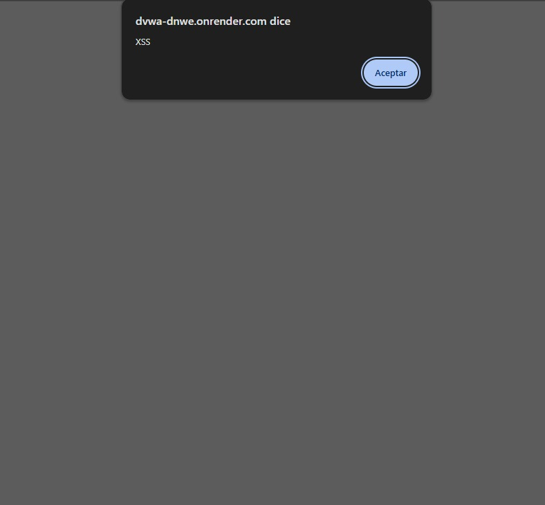

## 1. Evidencia del Ataque
*   **Módulo:** XSS (Reflected)    
*   **Payload (Texto introducido en el campo User ID):** `alert(’XSS’) (tanto al inicio como al final van un script )`  

*   **Evidencia Visual:** 

*(Esta captura de pantalla muestra una ventana de alerta en el navegador, confirmando que la página ejecutó la instrucción de código de manera exitosa).*

---

## 2. Explicación Técnica
La pagina web vulnerable reflejó la entrada directamente en la página web sin ningún tipo de limpieza o filtro. El navegador interpretó este texto no como el nombre de una persona, sino como una instrucción en JavaScript. Como consecuencia, el navegador ejecutó el código de forma automática, haciendo saltar la alerta visual en la pantalla.

---

## 3. Gravedad y Puntaje

*   **Puntaje Base:** 6.1 (Media) 
*   **Contexto EduKids:** Alta    
*   **Impacto en EduKids:** Un atacante podría enviarle un enlace falso o manipulado por correo a las mamás o papás del jardín. Cuando el apoderado hace clic, el código oculto puede robar las "cookies de sesión" de su navegador. Con esto, el criminal entra al portal haciéndose pasar por el apoderado, logrando modificar datos de entrega del menor o ver información privada sin saber la contraseña.

---

## 4. Política de Prevención e Implementación Segura

*   **Política:** Todo texto introducido por personas externas debe ser limpiado (sanitizado) o transformado antes de mostrarse en las pantallas del portal.
*   **Control de Mitigación (Código Seguro):** Se debe "Escapar la salida". Esto significa convertir los símbolos peligrosos como `<` y `>` en sus versiones de texto plano (`&lt;` y `&gt;`), para que el navegador los dibuje en pantalla como simples caracteres en vez de ejecutarlos como programas.
