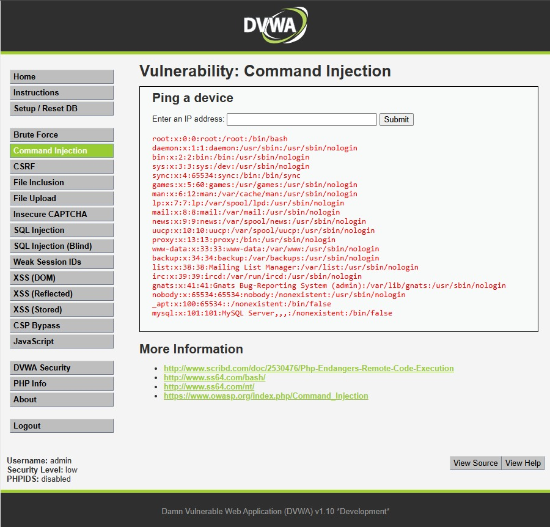

## 1. Evidencia del Ataque
*   **Módulo:** Command Injection  
*   **Payload (Texto introducido en el campo IP):** `127.0.0.1; cat /etc/passwd`  
*   **Evidencia Visual:**  

*(La captura de pantalla demuestra cómo el servidor ejecutó el diagnóstico de red y, acto seguido, expuso el archivo interno `/etc/passwd` con las cuentas del sistema operativo).*

---

## 2. Explicación Técnica

La **Inyección de Comandos** ocurre cuando el sistema operativo ejecuta la IP del usuario directamente en su consola interna de comandos. Al colocar el punto y coma ( ; ), el atacante le está diciendo a la computadora: *"Ejecuta la prueba de red **Y A CONTINUACIÓN** ejecuta esta otra orden del sistema"*. En este ataque usamos `cat /etc/passwd` para leer los usuarios de la máquina, lo que demuestra que el atacante ha logrado saltarse todas las barreras de la página web y ahora le da órdenes directas a la computadora central del jardín preescolar.

---

## 3. Gravedad y Puntaje

*   **Puntaje Base:** **9.8 / 10.0 (Crítica)**  
*   **Impacto en EduKids:** Esta es la falla más peligrosa de todas. Si el atacante tiene el control del servidor de EduKids, puede borrar por completo el sitio web del jardín, destruir los respaldos de las matrículas del año entero, instalar virus espía (*malware*) o apagar el servidor de forma indefinida, provocando un colapso operativo total en la institución.

---

## 4. Política de Prevención e Implementación Segura

*   **Política:** Queda terminantemente prohibido invocar la terminal de comandos del sistema operativo usando variables directas ingresadas por usuarios del portal.
*   **Control de Mitigación (Código Seguro):** Se debe aplicar una **Lista Blanca** estricta mediante expresiones regulares. El sistema solo debe procesar la solicitud si cumple a la perfección con la forma de una dirección IP (números separados por puntos). Si contiene un punto y coma (`;`) o letras, debe ser rechazada inmediatamente.
